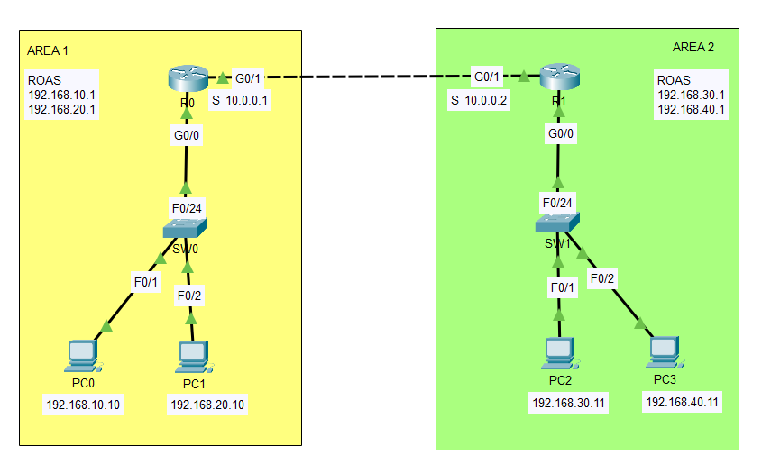

# Project 0 – Basic Network Setup

This project simulates a small enterprise network consisting of two separate areas (AREA1 and AREA2), interconnected via static routes on Cisco routers. Each area includes VLANs, switches, and end devices, offering a hands-on exercise in network segmentation, inter-VLAN routing, and static route configuration.

Ideal for students and junior system administrators preparing for the **CCNA certification** or looking to build foundational skills in **network design**, **routing**, and **Cisco device configuration**.

---

## 🧭 Topology



---


- **AREA1 (Router R0):**
  - `G0/0.10` → 192.168.10.1/24 (PC0: 192.168.10.10 – VLAN 10)
  - `G0/0.20` → 192.168.20.1/24 (PC1: 192.168.20.10 – VLAN 20)
  - `G0/1`    → 10.0.0.1/30 (Inter-router link to R1)

- **AREA2 (Router R1):**
  - `G0/0.10` → 192.168.30.1/24 (PC2: 192.168.30.11 – VLAN 10)
  - `G0/0.20` → 192.168.40.1/24 (PC3: 192.168.40.11 – VLAN 20)
  - `G0/1`    → 10.0.0.2/30 (Inter-router link to R0)

- **Switches:**
  - SW0: VLAN 10 (PC0), VLAN 20 (PC1), trunk to R0
  - SW1: VLAN 10 (PC2), VLAN 20 (PC3), trunk to R1

---

## ⚙️ Key Features

- Static routing between routers (R0 ↔ R1)
- Subinterface configuration for inter-VLAN routing
- Network segmentation using VLANs
- Packet Tracer/GNS3-compatible project structure

---

## 🧰 Requirements

- Cisco Packet Tracer, GNS3, or a compatible network simulator
- Basic knowledge of:
  - IP subnetting and addressing
  - VLANs and trunking
  - Static routing configuration

---

## 🚀 Setup Instructions

### 1. Clone the Repository
```bash
git clone https://github.com/system-admin-labs/Project_0_Basic_Network_Setup.git


🔧 Configuration Details
📍 Router R0

interface G0/0.10
 encapsulation dot1Q 10
 ip address 192.168.10.1 255.255.255.0

interface G0/0.20
 encapsulation dot1Q 20
 ip address 192.168.20.1 255.255.255.0

interface G0/1
 ip address 10.0.0.1 255.255.255.252

ip route 192.168.30.0 255.255.255.0 10.0.0.2
ip route 192.168.40.0 255.255.255.0 10.0.0.2

📍 Router R1

interface G0/0.10
 encapsulation dot1Q 10
 ip address 192.168.30.1 255.255.255.0

interface G0/0.20
 encapsulation dot1Q 20
 ip address 192.168.40.1 255.255.255.0

interface G0/1
 ip address 10.0.0.2 255.255.255.252

ip route 192.168.10.0 255.255.255.0 10.0.0.1
ip route 192.168.20.0 255.255.255.0 10.0.0.1

📍 Switch SW0

interface FastEthernet0/24
 switchport mode trunk

interface FastEthernet0/1
 switchport mode access
 switchport access vlan 10

interface FastEthernet0/2
 switchport mode access
 switchport access vlan 20

📍 Switch SW1

interface FastEthernet0/24
 switchport mode trunk

interface FastEthernet0/1
 switchport mode access
 switchport access vlan 30

interface FastEthernet0/2
 switchport mode access
 switchport access vlan 40

✅ Testing & Usage

Connectivity test:
Ping from PC0 (192.168.10.10) to PC2 (192.168.30.11)

Routing verification:

show ip route
VLAN and trunk verification (on switches):

show vlan brief
show interfaces trunk


```


### 🤝 Contributing
If you'd like to contribute improvements or extend the project (e.g., OSPF version, ACLs, NAT), feel free to fork this repository and open a pull request.

### 🙋 About the Author
I'm a system administrator in training with a strong interest in networking and cybersecurity. This project is part of a hands-on lab series I’m developing while preparing for the CCNA 200-301 certification and building my professional portfolio.

### 📚 References

Cisco Official Documentation

CCNA 200-301 Exam Blueprint

Cisco Packet Tracer Lab Scenarios
