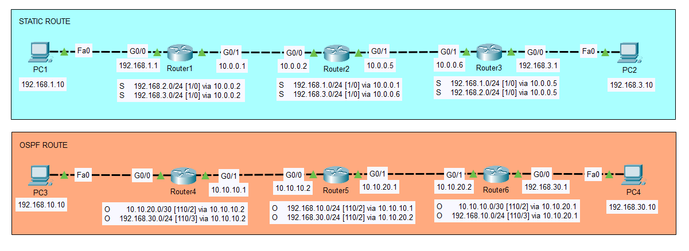

# Project 3 – IP Routing with OSPF and Static Routes

This lab demonstrates IP routing in a mixed network environment using both **Static Routing** and **OSPF (Open Shortest Path First)** dynamic routing. The network is divided into two main segments:

- 🔷 **Static Routing Segment**: Interconnects two PCs through three routers using manually configured static routes.
- 🟧 **OSPF Segment**: Connects two additional PCs through three routers using OSPF for automatic route discovery and convergence.

---

## 🧭 Topology



---

## 🧱 Devices and IP Scheme

### 🔷 Static Routing (Blue Segment)

| Device   | Interface     | IP Address     |
|----------|---------------|----------------|
| PC1      | Fa0           | 192.168.1.10   |
| Router1  | G0/0          | 192.168.1.1    |
|          | G0/1          | 10.0.0.1       |
| Router2  | G0/0          | 10.0.0.2       |
|          | G0/1          | 10.0.0.5       |
| Router3  | G0/0          | 10.0.0.6       |
|          | G0/1          | 192.168.3.1    |
| PC2      | Fa0           | 192.168.3.10   |

🛠️ Static routes are manually configured on each router to reach remote networks via the appropriate next hop.

---

### 🟧 OSPF Routing (Orange Segment)

| Device   | Interface     | IP Address     |
|----------|---------------|----------------|
| PC3      | Fa0           | 192.168.10.10  |
| Router4  | G0/0          | 192.168.10.1   |
|          | G0/1          | 10.10.10.1     |
| Router5  | G0/0          | 10.10.10.2     |
|          | G0/1          | 10.10.20.1     |
| Router6  | G0/0          | 10.10.20.2     |
|          | G0/1          | 192.168.30.1   |
| PC4      | Fa0           | 192.168.30.10  |

📡 OSPF is configured on all routers using **Area 0**. All interfaces participating in routing are included in the OSPF process, enabling automatic propagation of routes.

---

## 🎯 Goals

- Demonstrate the use of **Static Routing** vs **Dynamic Routing (OSPF)**
- Practice **subnetting** and **IP address planning**
- Configure and verify **end-to-end connectivity**
- Observe differences in route propagation using `show ip route`

---

## 🔧 Configuration Highlights

🔷 Static Routing – Blue Segment

Router1

```bash
ip route 192.168.3.0 255.255.255.0 10.0.0.2
```

Router2

```bash

ip route 192.168.1.0 255.255.255.0 10.0.0.1
ip route 192.168.3.0 255.255.255.0 10.0.0.6

```

Router3

```bash

ip route 192.168.1.0 255.255.255.0 10.0.0.5

```

🟧 OSPF Routing – Orange Segment

Router4

```bash

router ospf 1
network 192.168.10.0 0.0.0.255 area 0
network 10.10.10.0 0.0.0.255 area 0

```

Router5

```bash

router ospf 1
network 10.10.10.0 0.0.0.255 area 0
network 10.10.20.0 0.0.0.255 area 0


```

Router6

```bash

router ospf 1
network 10.10.20.0 0.0.0.255 area 0
network 192.168.30.0 0.0.0.255 area 0

```

✅ Results

✔️ Static routing enabled connectivity between PC1 and PC2

✔️ OSPF automatically discovered and propagated routes between Router4, Router5, and Router6

✔️ End-to-end ping tests confirmed successful connectivity across all segments


🧰 Tools Used
Cisco Packet Tracer

Command-Line Interface (CLI) for router configuration

