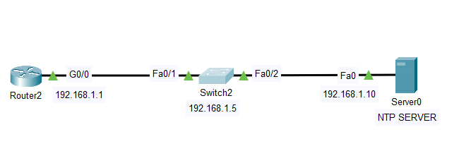

# 📡 Project 3 – Syslog and NTP Configuration

## 🧠 Overview

This lab focuses on implementing centralized **event logging** and **time synchronization** in a small network using **Syslog** and **NTP** protocols. The goal is to collect timestamped logs from both a router and a switch and ensure accurate time settings across the devices using a common NTP server.

---

## 🧭 Topology



---

[Router2] ←→ [Switch2] ←→ [Server0]
G0/0 Fa0/1 Fa0/2 (Switch)
Fa0 (Server)


All devices belong to the same subnet: `192.168.1.0/24`

---

## 🧱 Devices and IP Scheme

| Device   | Interface     | IP Address     | Role                      |
|----------|---------------|----------------|---------------------------|
| Router2  | G0/0          | 192.168.1.1    | Syslog + NTP Client       |
| Switch2  | VLAN 1        | 192.168.1.5    | Syslog + NTP Client       |
| Server0  | NIC (Fa0)     | 192.168.1.10   | Syslog + NTP Server       |

---

## 🎯 Objectives

- Enable **Syslog logging** on Router2 and Switch2
- Configure **Server0** to act as the centralized Syslog and NTP server
- Activate **timestamp logging** with millisecond accuracy
- Generate events by toggling interfaces to observe real-time logging
- Synchronize clocks using **NTP protocol**
- Verify correct log entries and synchronized timestamps

---

## ⚙️ Configuration Summary

### 🔧 Router2 Configuration
```bash
logging 192.168.1.10
service timestamps log datetime msec
ntp server 192.168.1.10

interface g0/1
shutdown
no shutdown

```

### 🔧 Switch2 Configuration

```bash

logging 192.168.1.10
service timestamps log datetime msec
ntp server 192.168.1.10

interface fa0/3
shutdown
no shutdown

```

### 🖥️ Server0 Setup

Enable Syslog service

Enable NTP service

Assign IP address: 192.168.1.10


### 🔍 Verification

✅ Syslog
Check logs on Server0 to confirm interface state changes from both Router2 and Switch2.

✅ NTP
Use the following commands to verify clock synchronization:

```bash

show clock
show ntp associations

```
