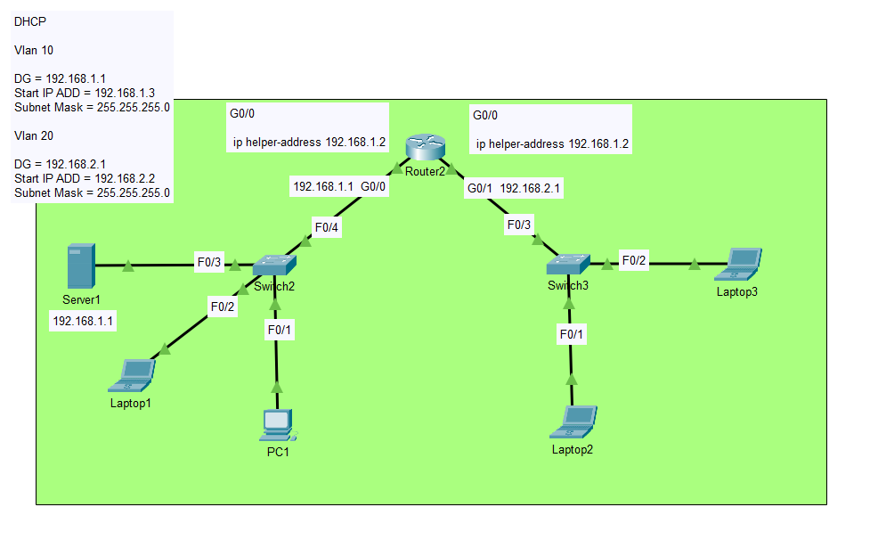
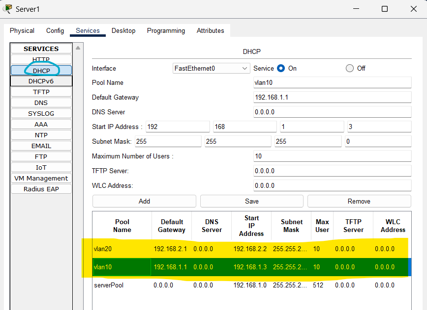

# Project 5.1 – DHCP, VLANs and Router-on-a-Stick

## Description

Segmented network utilizing VLANs 10 and 20, with a centralized DHCP server.  
The router performs inter-VLAN routing using subinterfaces (Router-on-a-Stick).  
Each VLAN is assigned its own IP range, gateway, and DHCP pool. The network includes IP helper addresses to relay DHCP requests across VLANs.

## Topology Overview




Devices:
- 🖧 Router2
- 🖧 Switch2
- 🖧 Switch3
- 🖥️ Server1 (DHCP)
- 💻 Laptop1 (VLAN 10)
- 💻 PC1 (VLAN 10)

- 💻 Laptop2 (VLAN 20)
- 💻 Laptop3 (VLAN 20)

## VLAN Configuration

- **VLAN 10**
  - Subnet: `192.168.1.0/24`
  - Gateway: `192.168.1.1`
  - DHCP Range: `192.168.1.2 – 192.168.1.3`
  - Maximum Users: 10

- **VLAN 20**
  - Subnet: `192.168.2.0/24`
  - Gateway: `192.168.2.1`
  - DHCP Range: `192.168.2.2 – 192.168.2.2`
  - Maximum Users: 10

## Server (DHCP) Configuration

Static IP: `192.168.1.1/24`  
Gateway: `192.168.1.1`

DHCP Pools configured:

| Pool Name | Gateway       | Start IP       | Subnet Mask     | Max Users |
|-----------|---------------|----------------|------------------|-----------|
| vlan10    | 192.168.1.1   | 192.168.1.2    | 255.255.255.0    | 10        |
| vlan20    | 192.168.2.1   | 192.168.2.2    | 255.255.255.0    | 10        |

## Router Configuration

```bash
enable
conf t

interface g0/0
 no shutdown
 ip helper-address 192.168.1.1  ! IP helper address to relay DHCP requests to Server1

interface g0/0.10
 encapsulation dot1Q 10
 ip address 192.168.1.1 255.255.255.0

interface g0/0.20
 encapsulation dot1Q 20
 ip address 192.168.2.1 255.255.255.0

interface g0/1
 ip address 192.168.2.1 255.255.255.0
 no shutdown

exit
copy run start
