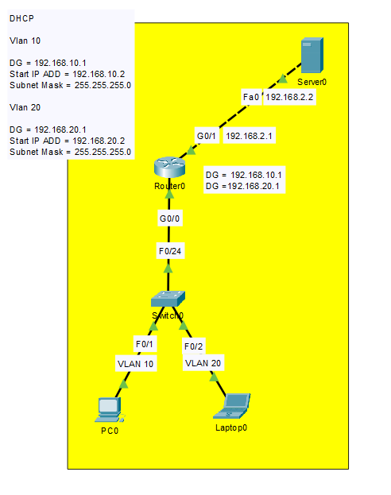
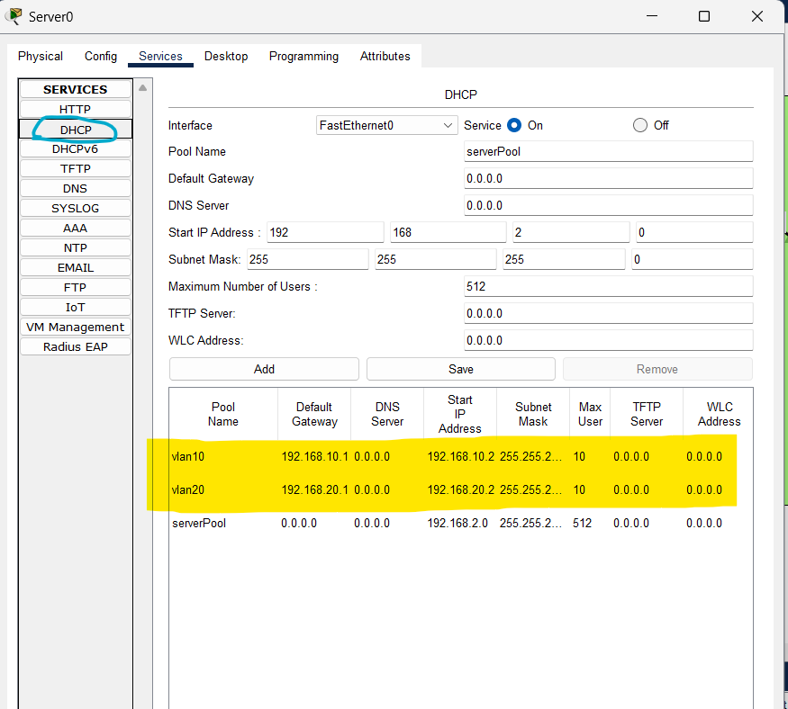

# Project 5 – DHCP, VLANs and Router-on-a-Stick

## Description

Segmented network using VLANs 10 and 20, with a centralized DHCP server.  
The router performs inter-VLAN routing using subinterfaces (Router-on-a-Stick).  
Each VLAN is assigned its own IP range, gateway, and DHCP pool.

## Topology Overview





Devices:
- 🖧 Router0
- 🖧 Switch0
- 🖥️ Server0 (DHCP)
- 💻 PC0 (VLAN 10)
- 💻 Laptop0 (VLAN 20)

## VLAN Configuration

- **VLAN 10**
  - Subnet: `192.168.10.0/24`
  - Gateway: `192.168.10.1`
  - DHCP Range: `192.168.10.2 – ...`

- **VLAN 20**
  - Subnet: `192.168.20.0/24`
  - Gateway: `192.168.20.1`
  - DHCP Range: `192.168.20.2 – ...`

## Server (DHCP) Configuration

Static IP: `192.168.2.2/24`  
Gateway: `192.168.2.1`

DHCP Pools configured:

| Pool Name | Gateway       | Start IP       | Subnet Mask     |
|-----------|---------------|----------------|------------------|
| vlan10    | 192.168.10.1  | 192.168.10.2   | 255.255.255.0    |
| vlan20    | 192.168.20.1  | 192.168.20.2   | 255.255.255.0    |

## Router Configuration

```bash
enable
conf t

interface g0/0
 no shutdown

interface g0/0.10
 encapsulation dot1Q 10
 ip address 192.168.10.1 255.255.255.0

interface g0/0.20
 encapsulation dot1Q 20
 ip address 192.168.20.1 255.255.255.0

interface g0/1
 ip address 192.168.2.1 255.255.255.0
 no shutdown

exit
copy run start

```

### Switch Configuration

```bash

enable
conf t

vlan 10
 name VLAN10

vlan 20
 name VLAN20

interface f0/1
 switchport mode access
 switchport access vlan 10

interface f0/2
 switchport mode access
 switchport access vlan 20

interface f0/24
 switchport mode trunk

exit
copy run start

```


