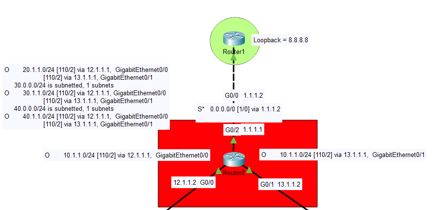
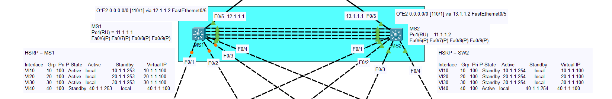
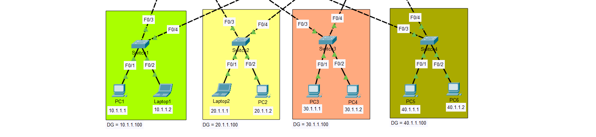

# Project 6 – OSPF, HSRP, VLANs, and Multi-Switch Topology

## Description

This project implements a segmented network using VLANs (10, 20, 30, and 40) with dynamic routing via OSPF (Open Shortest Path First) and high availability through HSRP (Hot Standby Router Protocol). The topology features a Router-on-a-Stick configuration with multiple switches, including a master/standby pair (MS1 and MS2) for redundancy, and downstream switches (Switch1, Switch2, Switch3, Switch4) connecting end devices. A central router (Router1) serves as the gateway, connected via a distribution switch (S*).

## Topology Overview






### Devices
- 🖧 **Router1**: Primary gateway router with a loopback interface.
- 🖧 **Router0**: Core router performing inter-VLAN routing and HSRP coordination.
- 🖧 **Switch S***: Distribution switch connecting Router1 to the network.
- 🖧 **Switch MS1**: Master switch for HSRP, managing VLANs 10, 20, and 30.
- 🖧 **Switch MS2**: Standby switch for HSRP, managing VLAN 40.
- 🖧 **Switch1**: Access switch for VLAN 10 devices.
- 🖧 **Switch2**: Access switch for VLAN 20 devices.
- 🖧 **Switch3**: Access switch for VLAN 30 devices.
- 🖧 **Switch4**: Access switch for VLAN 40 devices.
- 💻 **PC1**: Client device in VLAN 10.
- 💻 **Laptop1**: Client device in VLAN 10.
- 💻 **Laptop2**: Client device in VLAN 20.
- 💻 **PC2**: Client device in VLAN 20.
- 💻 **PC3**: Client device in VLAN 30.
- 💻 **PC4**: Client device in VLAN 30.
- 💻 **PC5**: Client device in VLAN 40.
- 💻 **PC6**: Client device in VLAN 40.

## VLAN Configuration

The network is segmented into four VLANs, each with its own subnet, gateway, and associated devices:

- **VLAN 10**
  - Subnet: `10.1.1.0/24`
  - Gateway: `11.1.1.1` (HSRP virtual IP)
  - Device IPs: 
    - PC1: `10.1.1.1`
    - Laptop1: `10.1.1.2`
  - Active Switch: MS1 (Standby: MS2)

- **VLAN 20**
  - Subnet: `20.1.1.0/24`
  - Gateway: `11.1.1.1` (HSRP virtual IP)
  - Device IPs:
    - Laptop2: `20.1.1.1`
    - PC2: `20.1.1.2`
  - Active Switch: MS1 (Standby: MS2)

- **VLAN 30**
  - Subnet: `30.1.1.0/24`
  - Gateway: `11.1.1.1` (HSRP virtual IP)
  - Device IPs:
    - PC3: `30.1.1.1`
    - PC4: `30.1.1.2`
  - Active Switch: MS1 (Standby: MS2)

- **VLAN 40**
  - Subnet: `40.1.1.0/24`
  - Gateway: `11.1.1.1` (HSRP virtual IP)
  - Device IPs:
    - PC5: `40.1.1.1`
    - PC6: `40.1.1.2`
  - Active Switch: MS2 (Standby: MS1)

## IP Configuration Details

### Router1
- **Loopback0**: `8.8.8.8` (OSPF router ID)
- **GigabitEthernet0/0**:
  - Subinterface for `20.1.1.0/24`: `20.1.1.1`
  - Subinterface for `30.1.1.0/24`: `30.1.1.1`
  - Subinterface for `40.1.1.0/24`: `40.1.1.1`
  - Connected to Switch S* at `1.1.1.2`

### Router0
- **G0/0**: `12.1.1.2` (connected to Switch MS1)
- **G0/1**: `13.1.1.2` (connected to Switch MS2)
- **Ethernet0/0**: `0.0.0.0/0` (external interface, Static route)

### Switch MS1 (Master)
- **FastEthernet0/6**: `12.1.1.1` (connected to Router0 G0/0)
- **Po1(RU)**: `11.1.1.2` (Port Channel to Switch MS2, HSRP virtual IP: `11.1.1.1`)
- VLAN Interfaces:
  - V10: `10.1.1.0/24`, Active
  - V20: `20.1.1.0/24`, Active
  - V30: `30.1.1.0/24`, Active
  - V40: `40.1.1.0/24`, Standby

### Switch MS2 (Standby)
- **FastEthernet0/5**: `13.1.1.1` (connected to Router0 G0/1)
- **Po1(RU)**: `11.1.1.2` (Port Channel to Switch MS1, HSRP virtual IP: `11.1.1.1`)
- VLAN Interfaces:
  - V10: `10.1.1.0/24`, Standby
  - V20: `20.1.1.0/24`, Standby
  - V30: `30.1.1.0/24`, Standby
  - V40: `40.1.1.0/24`, Active

### Switch S*
- **G0/0**: `1.1.1.1` (connected to Router1 G0/0)

### Downstream Switches
- **Switch1**: Connected to MS1 (F0/1) and MS2 (F0/2), serves VLAN 10 devices.
- **Switch2**: Connected to MS1 (F0/1) and MS2 (F0/2), serves VLAN 20 devices.
- **Switch3**: Connected to MS1 (F0/1) and MS2 (F0/2), serves VLAN 30 devices.
- **Switch4**: Connected to MS1 (F0/1) and MS2 (F0/2), serves VLAN 40 devices.

## Routing and Redundancy Configuration

### OSPF Configuration
- **Area**: 0 (single area configuration)
- **Router IDs**:
  - Router1: `8.8.8.8` (Loopback0)
  - Router0: Dynamically assigned (likely based on highest IP)
- **Routes on Router0**:
  - `10.1.1.0/24` via `12.1.1.1`
  - `20.1.1.0/24` via `13.1.1.1`
  - `30.1.1.0/24` via `12.1.1.1`
  - `40.1.1.0/24` via `13.1.1.1`
- **Routes on Router1**:
  - `10.1.1.0/24` via `1.1.1.2`
  - `20.1.1.0/24` via `1.1.1.2`
  - `30.1.1.0/24` via `1.1.1.2`
  - `40.1.1.0/24` via `1.1.1.2`

### HSRP Configuration
- **Virtual IP**: `11.1.1.1` across all VLANs
- **Active Router**: 
  - MS1 for VLANs 10, 20, and 30
  - MS2 for VLAN 40
- **Standby Router**: 
  - MS2 for VLANs 10, 20, and 30
  - MS1 for VLAN 40
- **Port Channel**: `Po1` between MS1 and MS2 ensures link redundancy.

## Sample Router Configurations

### Router0
```bash
enable
conf t
interface g0/0
 ip address 12.1.1.2 255.255.255.0
 no shutdown
interface g0/1
 ip address 13.1.1.2 255.255.255.0
 no shutdown
router ospf 1
 network 12.1.1.0 0.0.0.255 area 0
 network 13.1.1.0 0.0.0.255 area 0
exit
copy run start

ip route 0.0.0.0 0.0.0.0 1.1.1.2 

```

### Router1


```bash

enable
conf t
interface loopback0
 ip address 8.8.8.8 255.255.255.255
interface g0/0
 ip address 1.1.1.2 255.255.255.0
 no shutdown
router ospf 1
 network 1.1.1.0 0.0.0.255 area 0
 network 20.1.1.0 0.0.0.255 area 0
 network 30.1.1.0 0.0.0.255 area 0
 network 40.1.1.0 0.0.0.255 area 0
exit
copy run start

```

Switch MS1 (Partial)


```bash

enable
conf t
interface vlan 10
 ip address 10.1.1.1 255.255.255.0
 standby 1 ip 11.1.1.1
 standby 1 priority 110
interface vlan 20
 ip address 20.1.1.1 255.255.255.0
 standby 1 ip 11.1.1.1
 standby 1 priority 110
interface vlan 30
 ip address 30.1.1.1 255.255.255.0
 standby 1 ip 11.1.1.1
 standby 1 priority 110
interface vlan 40
 ip address 40.1.1.1 255.255.255.0
 standby 1 ip 11.1.1.1
 standby 1 priority 100
interface port-channel 1
 no shutdown
router ospf 1
 network 10.1.1.0 0.0.0.255 area 0
 network 20.1.1.0 0.0.0.255 area 0
 network 30.1.1.0 0.0.0.255 area 0
 network 40.1.1.0 0.0.0.255 area 0
exit
copy run start

```

Switch MS1 (Partial)


```bash

enable
conf t
interface vlan 10
 ip address 10.1.1.2 255.255.255.0
 standby 1 ip 11.1.1.1
 standby 1 priority 100
interface vlan 20
 ip address 20.1.1.2 255.255.255.0
 standby 1 ip 11.1.1.1
 standby 1 priority 100
interface vlan 30
 ip address 30.1.1.2 255.255.255.0
 standby 1 ip 11.1.1.1
 standby 1 priority 100
interface vlan 40
 ip address 40.1.1.2 255.255.255.0
 standby 1 ip 11.1.1.1
 standby 1 priority 110
interface port-channel 1
 no shutdown
interface fastEthernet0/5
 channel-group 1 mode active
interface range fastEthernet0/1-2
 switchport mode access
 switchport access vlan 40
router ospf 1
 network 10.1.1.0 0.0.0.255 area 0
 network 20.1.1.0 0.0.0.255 area 0
 network 30.1.1.0 0.0.0.255 area 0
 network 40.1.1.0 0.0.0.255 area 0
exit
copy run start

```
