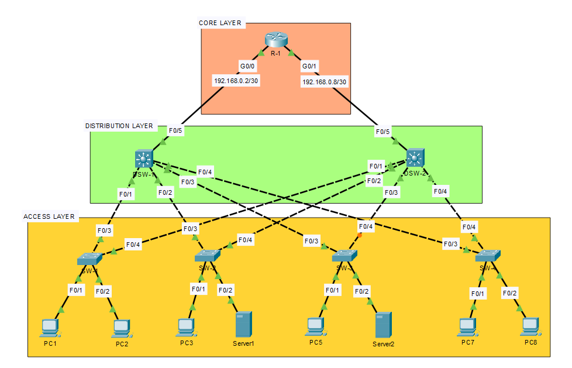

# Project_7_dhcp_vlan_portsecurity

## 📘 Description

This project represents a **Cisco three-tier hierarchical network topology** designed using **Core**, **Distribution**, and **Access** layers.

The goal is to demonstrate how to build a **scalable**, **redundant**, and **segmented** network architecture using multilayer switches, routers, and end devices.

## Topology Overview

The topology includes:

- A structured three-layer design
- Redundancy between switches
- Potential use of VLANs, STP, and inter-VLAN routing

## 🧠 Architecture

### 1. **Core Layer**
- 1 Router (`R-1`)
- Point-to-point links to the distribution switches
- Interfaces:
  - `G0/0`: 192.168.0.2/30
  - `G0/1`: 192.168.0.8/30

### 2. **Distribution Layer**
- 2 multilayer switches (`SW-1`, `SW-2`)
- Each switch connects to multiple access layer switches
- Full redundancy between the two distribution switches

### 3. **Access Layer**
- 4 Access switches (`SW-A`, `SW-B`, `SW-C`, `SW-D`)
- Connected to end devices (PCs, Servers)
- Each access switch has redundant uplinks to both distribution switches

## 🧰 Technologies & Concepts Used

- Cisco Packet Tracer
- Hierarchical Network Design
- Subnetting (/30 for point-to-point links)
- VLANs (optional)
- STP / RSTP (to manage redundancy)
- Inter-VLAN Routing (via multilayer switch or router)
- High-availability networking

## 🗂️ Repository Structure

