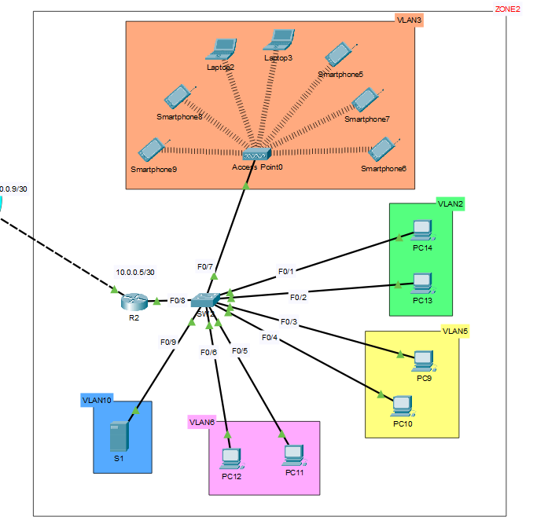

# 🖧 Company Network – Zone 2  

This lab simulates **Zone 2** of a company network using Cisco Packet Tracer.  
It includes **multiple VLANs**, **Router-on-a-Stick (ROAS)** configuration, a **central DHCP server**, **ACLs for inter-VLAN traffic control**, **static routing**, and **OSPF for dynamic routing** between the site and the ISP.  

---

## Topology Overview



## 🔹 Topology Overview

- **Router R2**: Performs inter-VLAN routing and connects to the ISP.  
- **Switch SW1**: Manages VLANs and trunking to the router.  
- **Server S1 (VLAN10)**: Provides centralized DHCP services.  
- **PCs and Wireless Clients**: Distributed across VLANs 2, 3, 5, 6, and 10.  
- **ISP Router**: Simulates external connectivity.  

---

## 🔹 VLANs and Subnetting

| VLAN  | Purpose         | Subnet               | Gateway (Router Subinterface) |
|-------|-----------------|---------------------|-----------------------------|
| VLAN2 | Staff PCs       | 192.168.1.0/27      | 192.168.1.1                 |
| VLAN3 | Wireless        | 192.168.1.64/28     | 192.168.1.65                |
| VLAN5 | Finance         | 192.168.1.32/28     | 192.168.1.33                |
| VLAN6 | HR              | 192.168.1.48/28     | 192.168.1.49                |
| VLAN10| Servers         | 192.168.1.96/28     | 192.168.1.97                |

---

## 🔹 Router R2 Configuration (ROAS + Routing)

```bash
enable
configure terminal

! Subinterfaces for VLANs
interface g0/0.2
 encapsulation dot1Q 2
 ip address 192.168.1.1 255.255.255.224
 no shutdown

interface g0/0.3
 encapsulation dot1Q 3
 ip address 192.168.1.65 255.255.255.240
 no shutdown

interface g0/0.5
 encapsulation dot1Q 5
 ip address 192.168.1.33 255.255.255.240
 no shutdown

interface g0/0.6
 encapsulation dot1Q 6
 ip address 192.168.1.49 255.255.255.240
 no shutdown

interface g0/0.10
 encapsulation dot1Q 10
 ip address 192.168.1.97 255.255.255.240
 no shutdown

! Uplink to ISP
interface g0/1
 ip address 10.0.0.14 255.255.255.252
 no shutdown

```

🔹 Switch Configuration

```bash
enable
configure terminal

vlan 2
 name STAFF
vlan 3
 name WIRELESS
vlan 5
 name FINANCE
vlan 6
 name HR
vlan 10
 name SERVERS

interface range f0/1 - f0/2
 switchport mode access
 switchport access vlan 2

interface range f0/3 - f0/4
 switchport mode access
 switchport access vlan 5

interface range f0/5 - f0/6
 switchport mode access
 switchport access vlan 6

interface f0/9
 switchport mode access
 switchport access vlan 10

interface f0/7
 switchport mode access
 switchport access vlan 3

! Trunk to Router
interface f0/8
 switchport trunk encapsulation dot1q
 switchport mode trunk
```

🔹 DHCP Server Setup (On Server S1)

For each VLAN, create a pool in the DHCP service:

VLAN	Gateway	Start IP	Subnet Mask	DNS Server
VLAN2	192.168.1.1	192.168.1.2	255.255.255.224	8.8.8.8
VLAN3	192.168.1.65	192.168.1.66	255.255.255.240	8.8.8.8
VLAN5	192.168.1.33	192.168.1.34	255.255.255.240	8.8.8.8
VLAN6	192.168.1.49	192.168.1.50	255.255.255.240	8.8.8.8
VLAN10	192.168.1.97	192.168.1.98	255.255.255.240	8.8.8.8

🔹 DHCP Relay (Router R2)

```bash
interface g0/0.2
 ip helper-address 192.168.1.82
interface g0/0.3
 ip helper-address 192.168.1.82
interface g0/0.5
 ip helper-address 192.168.1.82
interface g0/0.6
 ip helper-address 192.168.1.82
```

🔹 ACLs to Isolate VLANs

```bash
ip access-list extended IN-VLAN2
 permit udp any eq bootpc host 192.168.1.100 eq bootps
 permit udp host 192.168.1.100 eq bootps any eq bootpc
 deny ip 192.168.1.0 0.0.0.31 192.168.1.32 0.0.0.15
 deny ip 192.168.1.0 0.0.0.31 192.168.1.48 0.0.0.15
 deny ip 192.168.1.0 0.0.0.31 192.168.1.64 0.0.0.15
 permit ip 192.168.1.0 0.0.0.31 any

interface g0/0.2
 ip access-group IN-VLAN2 in
```
Similar ACLs were applied for VLAN3, VLAN5, and VLAN6

🔹 OSPF Configuration (on Router R2)

```bash
router ospf 1
 router-id 2.2.2.2
 network 10.0.0.12 0.0.0.3 area 0
 network 192.168.1.0 0.0.0.31 area 0
 network 192.168.1.32 0.0.0.15 area 0
 network 192.168.1.48 0.0.0.15 area 0
 network 192.168.1.64 0.0.0.15 area 0
 network 192.168.1.96 0.0.0.15 area 0
```

🔹 Summary

✅ Multiple VLANs with subnetting
✅ Router-on-a-Stick for inter-VLAN routing
✅ Central DHCP server with IP helper addresses
✅ ACLs to control inter-VLAN communication
✅ OSPF for dynamic routing between Router R2 and ISP
✅ Scalable design for enterprise networks
