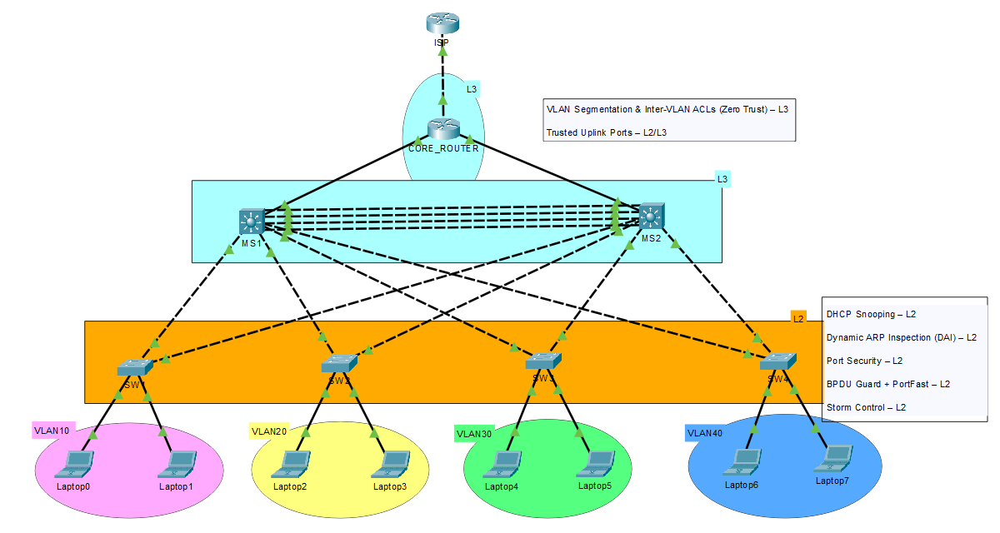

# 🔒 Enterprise Lab Network Security Configuration

This README documents the security features implemented in an enterprise lab network to simulate realistic, enterprise-grade security controls on Layer 2 and Layer 3 devices. Management security and device hardening are excluded from this documentation.

The goal is to enforce a **Zero Trust** model, protect against common Layer 2/3 attacks, and ensure network stability and scalability.

---

## 🧭 Topology



---

## 📋 Table of Contents
* [1. VLAN Segmentation & Inter-VLAN ACLs (Zero Trust)](#1-vlan-segmentation--inter-vlan-acls-zero-trust)
* [2. DHCP Snooping](#2-dhcp-snooping)
* [3. Dynamic ARP Inspection (DAI)](#3-dynamic-arp-inspection-dai)
* [4. Port Security](#4-port-security)
* [5. BPDU Guard & STP PortFast](#5-bpdu-guard--stp-portfast)
* [6. Storm Control](#6-storm-control)
* [7. Trusted Uplink Ports](#7-trusted-uplink-ports)
* [8. Summary of Security Features](#8-summary-of-security-features)
* [9. Network Diagram](#9-network-diagram)

---

## * 1. VLAN Segmentation & Inter-VLAN ACLs (Zero Trust)

* **Purpose**: Enforce Zero Trust by explicitly controlling inter-VLAN communication using Extended Access Control Lists (ACLs).
* **Configuration**: ACLs are applied **inbound** on each Switched Virtual Interface (SVI) of distribution (multilayer) switches.
* **Example for VLAN10** (similar ACLs applied for VLAN20, VLAN30, VLAN40):
  ```bash
  ip access-list extended VLAN10_IN
   deny ip 10.1.1.0 0.0.0.255 20.1.1.0 0.0.0.255
   deny ip 10.1.1.0 0.0.0.255 30.1.1.0 0.0.0.255
   deny ip 10.1.1.0 0.0.0.255 40.1.1.0 0.0.0.255
   permit ip any any

  interface vlan10
   ip access-group VLAN10_IN in
  ```

Outcome:Prevents direct communication between VLANs (e.g., VLAN10 cannot reach VLAN20, VLAN30, or VLAN40).
Only explicitly permitted traffic (e.g., Internet-bound) is allowed.

* 2. DHCP SnoopingPurpose: Prevent rogue DHCP servers from assigning malicious IP addresses.
Configuration:Enabled on all switches for VLANs 10, 20, 30, and 40.
Only uplink/trunk interfaces to trusted devices (e.g., MS1, MS2, Core) are marked as trusted.

```bash

ip dhcp snooping
ip dhcp snooping vlan 10,20,30,40
```
```bash

interface fa0/5
 ip dhcp snooping trust
```
Outcome:Ensures DHCP replies are only accepted from trusted ports.
Mitigates unauthorized DHCP server attacks.

* 3. Dynamic ARP Inspection (DAI)Purpose: Mitigate ARP spoofing and Man-in-the-Middle (MitM) attacks.
Configuration:Enabled for VLANs 10, 20, 30, and 40.
Trusted ports explicitly defined; access ports remain untrusted by default.

```bash

ip arp inspection vlan 10,20,30,40
```
```bash

interface fa0/1
 ip arp inspection limit rate 30
```
```bash

interface fa0/5
 ip arp inspection trust
```
Outcome:Validates ARP packets against the DHCP Snooping binding table.
Protects against ARP poisoning attacks.

* 4. Port SecurityPurpose: Restrict the number of devices per access port to prevent unauthorized connections.
Configuration:Applied on all access ports with a maximum of 2 MAC addresses.
Uses sticky MAC learning and restricts violations.

```bash

interface range fa0/1 - 24
 switchport mode access
 switchport port-security
 switchport port-security maximum 2
 switchport port-security violation restrict
 switchport port-security mac-address sticky
```
Outcome:Limits MAC addresses per port to 2.
Restricts unknown MAC addresses.
Dynamically learns and saves MAC addresses in the running configuration.

* 5. BPDU Guard & STP PortFastPurpose: Protect Spanning Tree Protocol (STP) topology and speed up host port convergence.
Configuration:Enabled on all access ports.

```bash

interface range fa0/1 - 24
 spanning-tree bpduguard enable
 spanning-tree portfast
```
Outcome:Prevents unauthorized switches from participating in STP.
Reduces convergence time for host ports.

* 6. Storm ControlPurpose: Mitigate broadcast and multicast storms to ensure network stability.
Configuration:Applied on all access ports to limit broadcast and multicast traffic to 5% of bandwidth.

```bash

interface range fa0/1 - 24
 storm-control broadcast level 5.00
 storm-control multicast level 5.00
```
Outcome:Drops excessive broadcast/multicast traffic.
Protects against Layer 2 broadcast storms.

* 7. Trusted Uplink PortsPurpose: Ensure proper functionality of control plane protocols on trunk/uplink ports.
Configuration:Trunk ports to distribution switches/routers are marked as trusted for DHCP Snooping and ARP Inspection.

```bash

interface fa0/24
 switchport mode trunk
 ip dhcp snooping trust
 ip arp inspection trust
```
Outcome:Prevents false positives on inter-switch or uplink connections.
Ensures seamless operation of control plane protocols.

## * 8. Summary of Security Features

| **Feature**              | **Layer** | **Device Type**           | **Purpose**                          |
|--------------------------|-----------|---------------------------|--------------------------------------|
| Inter-VLAN ACLs          | L3        | Distribution / Core       | Zero Trust segmentation              |
| DHCP Snooping            | L2        | All Switches              | Block rogue DHCP servers             |
| Dynamic ARP Inspection   | L2        | All Switches              | Prevent ARP spoofing attacks         |
| Port Security            | L2        | Access Switches           | Limit devices per port               |
| BPDU Guard + PortFast    | L2        | Access Switches           | Protect STP & speed convergence      |
| Storm Control            | L2        | Access Switches           | Mitigate broadcast/multicast storms  |
| Trusted Uplink Ports     | L2/L3     | Distribution / Core Links | Ensure correct uplink functionality  |
